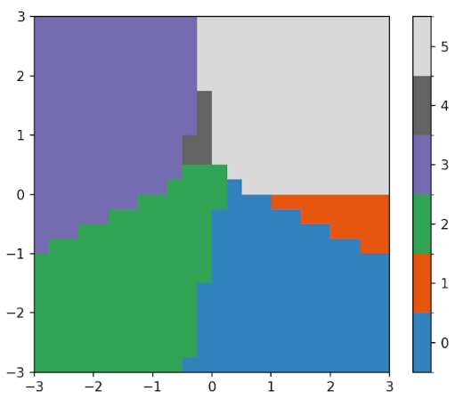
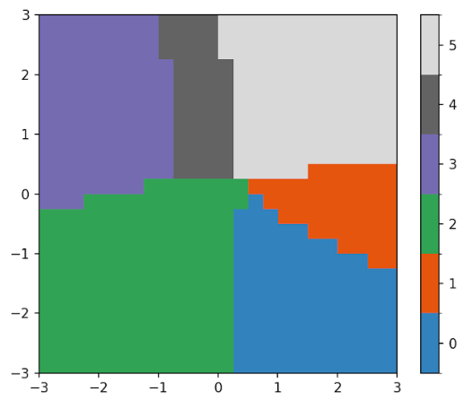
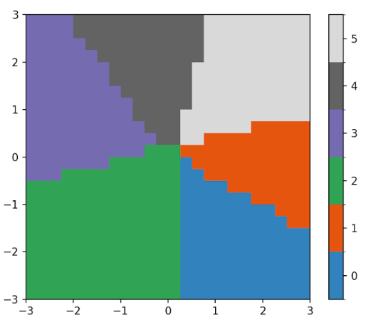
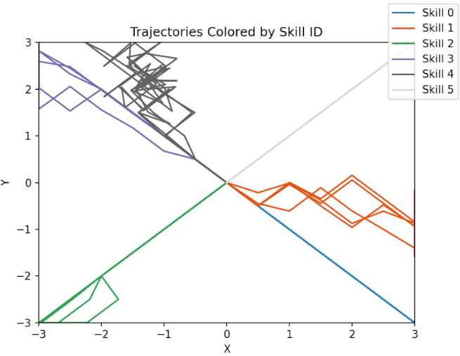
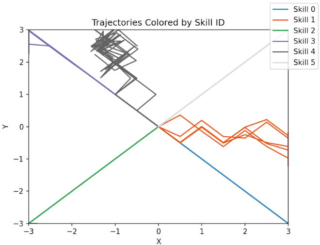
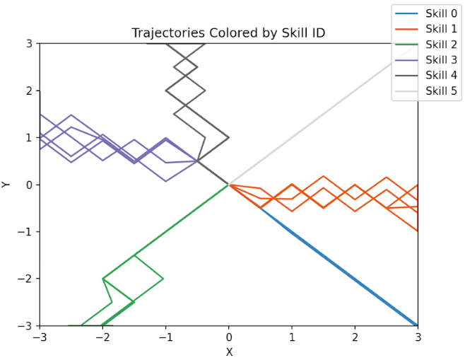
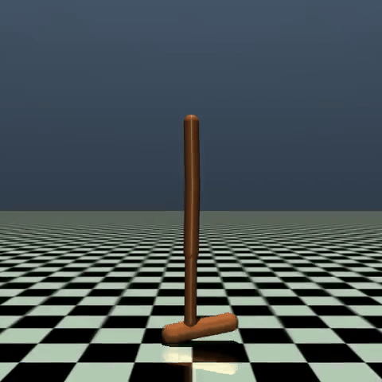
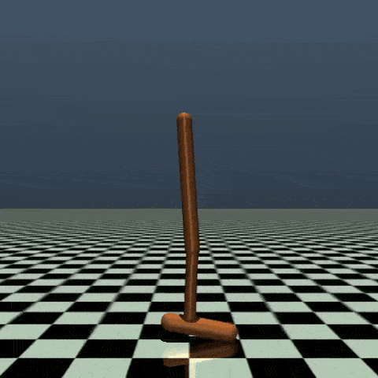
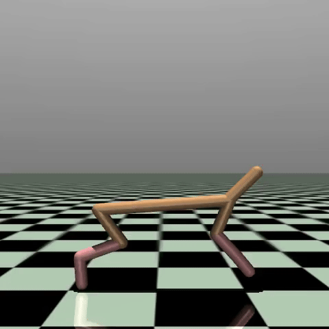
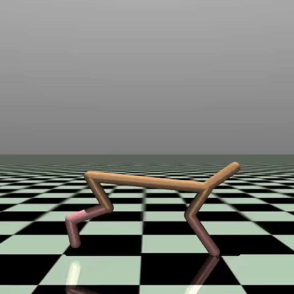

# Diversity Is All You Need (CS8803 DRL)

Many RL algorithms rely on a explicit reward function which guides the agent in achieving skills to fulfil some action. DIAYN (Diversity is all you need) is a powerful approach for unsupervised skill discovery in reinforcment learning without reward functions.

DIAYN enables reinforcment learning agents to autonomously discover and learn a diverse set of skills through information-theoretic methods and maximum entropy policy optimisation. Our implementation expands upon the foundational work by Eysenbach et al., providing a delta to the initial research. 

We attempt to learn latent layers from the state information using DIAYN first to see if doing this step prior to learning actions can result in additional emergent behaviours from the agent.

We then attempt to distill these networks into a single network creating a more condensed policy network for control of the agent.

DIAYN uses the following reward function to guide the skill discovery process:

$$r_z(s,a)\triangleq \log q_\phi (z|s)-\log p(z)$$

where $q_\phi(z|s)$ represents the discriminator that attempts to identify the skill $z$ from the state $s$ and $p(z)$ is the prior distribution over the skills.

## Todo:
- Learn latent layers from state information
- Implement network distillation

## Results

DIAYN aims to maximise the mutual information between latent skill variables and states visited by the agent, ensuring that different skills lead to distinct trajectories.

In the figures below, The top row illustrates the stae space partition based on each latent skill in a 2D navigation task. The bottom row of images shows the trajectories in 2D spaced coloured according to a specific skill ID. These trajectories validate the ability to produce a diverse set of behaviours.

100 Episodes| 200 Episodes| 300 Episodes
:-----------------------:|:-----------------------:|:-----------------------:
| | 
| | 


### Hopper

similar to the environment's goal| Emergent behavior
:-----------------------:|:-----------------------:
| 
Reward distribution|Reward distribution
| 


### Cheetah

similar to the environment's goal| Emergent behavior
:-----------------------:|:-----------------------:
| 
Reward distribution|Reward distribution
| | 


## Setup
```
git clone <this repo> <name of directory to clone into>
cd <name of directory to clone into>
./scripts/setup.sh # or .\scripts\setup.bat for window
```

The `setup.sh` or `setup.bat` script will setup a virtual environment for the project.

Note: If you're cloning into a workspace, I recommend changing name of directory to clone into. VS Code may have problem with code suggestions.

To use non default python for setup
```
PYTHON_EXEC=<path of python to use> ./scripts/setup.sh
```


Installing DIAYN
```
# Activate venv

# Install Module
python3 -m pip install -e .
```

## Tensorboard Diagram Visualization

```
# Navigate to example folder
cd <project_dir>/examples

# Open tensorboard using data from runs folder
tensorboard --logdir=runs
```


## Note on project organization
Not very strict.

(Rachanon) put running code and experiments into the `examples` directory. The code in the `DIAYN` module shouldnt really change across experiments unless you're adding a new feature.
